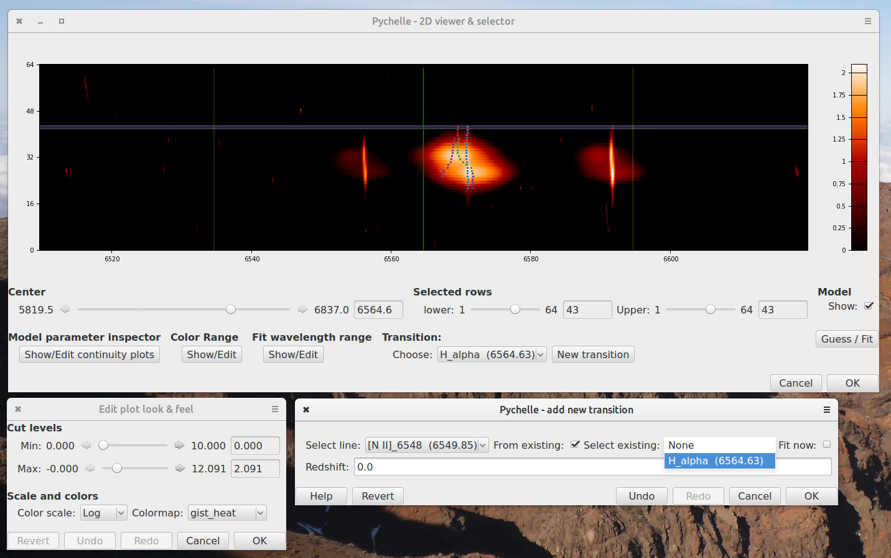
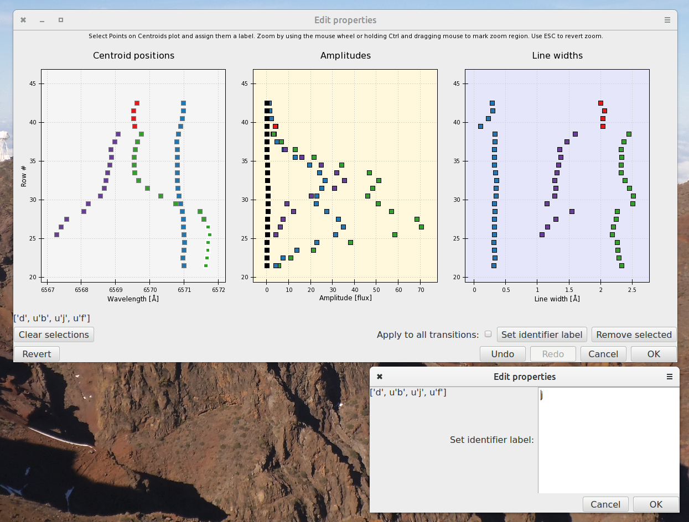

# Pychelle

Pychelle is a **Py**thon helper app for 1D and 2D e**chelle** (and, to be
honest, also most other kinds of) spectroscopy. It allows to load a 2D
spectrum, select and extract a subset of the rows for modelling, building
models by eye and calling a back-end fitter (for now, only [LMfit]) to perform
the fitting. It allows to set the included and ignored fit ranges for each row
or set of rows, and assigning identifying labels and color codes to individual
components, allowing to treat them group-wise. 

It manages transitions based on an easily extensible plain-text list. The
resulting model is returned as a Pandas DataFrame. 

The repository includes a sample data set of supernova 1984A, observed with
the UVES spectrograph at the ESO Very Large Telescope in Paranal, Chile. The
spectrum is public and the first analysis was presented in this [paper] (*not*
using Pychelle).

# Dependencies

Pychelle depends on the standard [SciPy stack](www.scipy.org) and, on top of
that the [Enthought Tool Suite](code.enthough.com/projects), especially Traits
& TraitsUI (GUI and interface libraries) and Chaco (plotting package). 

Optional requirements are [Astroquery] and its dependency [Astropy] for
finding redshifts online, and [LMfit] necessary for actual fitting.

# Caveats & limitations

Pychelle is presented here as-is, mainly for the purpose of showcasing,
although it should also be usable -- See this [presentation] for an example.
However, it has several bugs and things that could be done better; I will fix
these when I have time, but I am of course thankful for pull requests. 

One known bug is that sometimes, reassigning identifier labels gets applied to
the wrong components, and there is no way to revert this. It is probably not a
very difficult bug to squash, but I have not had time to fix it yet.

The modeling interface so far only supports a constant continuum and Gaussian
emission peaks. Gaussian absorption is trivial to add, but other continuum and
line profiles require a bit more work.

Data in units that give very small numerical values can give the viewer
problems. A simple workaround is to multiply the data, errors and model
amplitudes by the same number, and divide them again when saving. 

# Screenshots

Test data loaded into main window. Below is the colorscale editor dialog and
the add-transition dialog. The latter supports adding a new transition based on
the kinematics of an existing one and performing an immediate, quick fit of the
new one allowing only the amplitudes to vary. 

Wavelength range editor window:

The 1D model editor and fitting window. The lower plot panel shows residuals in
terms of error spectrum. 

Finally, the component editor. The three plot panels shows the three Gaussian
parameters: Center, amplitude and width (given as \(\sigma\)). Colors reflect
one-letter ID labels, which can be reassigned with the bottom dialog. 

# Simple test session

First, the import:

~~~python 
import pychelle as pc 
~~~

Next, load the data into a `Spectrum2D` object, and in turn load this into a
`Show2DSpec` object:

~~~python
sn = pc.load_2d('./testdata/SN1987a-Halpha.fits', objname='SN1987a')
SN = pc.view_2d(sn, Center=6564.)  # To view the H-Alpha region
~~~

The model, data and other quantities can now be retreived as properties of the
`Spectrum2D` object, e.g.

~~~python
fluxes = sn.flux  # Integrated flux for each model component
data = sn.data
error_spectrum = sn.errs
wave = sn.wavl
model = sn.model
~~~

# TODO

- [x] 2D Spectrum object
- [x] Main overview window
- [x] Transition manager
- [x] Set wavelength ranges graphically
- [x] Set colorscale: Linear, log or square root. Select colorscheme.
- [x] Interactively build multi-component emission model by eye
- [x] Optionally call back-end fitting software, integrate results into model
- [x] Assign and edit ID labels for individual components
- [x] Save model as plain-text .csv file, read and import saved model
- [ ] Save model as FITS file with metadata as header keywords
- [ ] Support more different line shapes and absorption lines
- [ ] Support velocity space besides wavelengths
- [ ] Support more fitting backends (e.g. Sherpa, scipy.optimize,
      Astropy.modeling etc. )
- [ ] Improve documentation.
- [ ] Longer term: rewrite to be based on Astropy

[LMfit]: http://lmfit.github.io 
[presentation]: http://bit.ly/EsoHaroTalk
[paper]: www.google.com 
[Astroquery]: https://astroquery.readthedocs.io/en/latest/ 
[Astropy]: www.astropy.org
